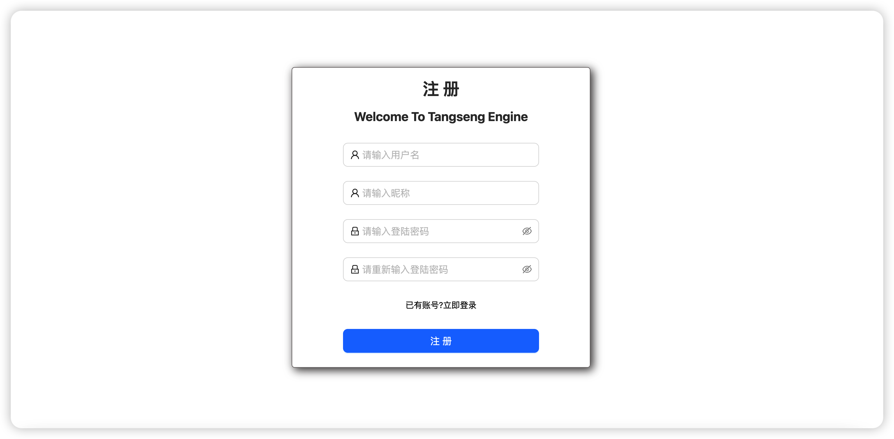
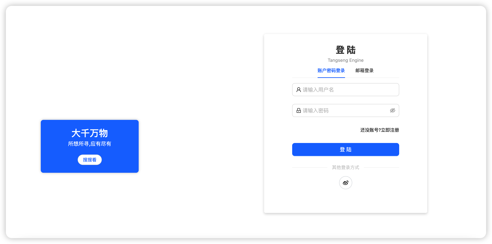
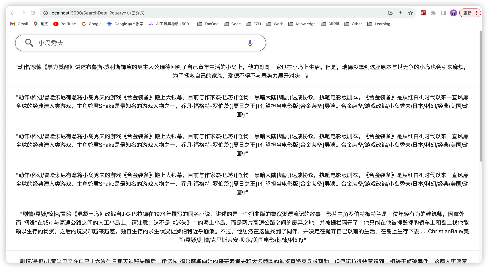

# React-Tangseng

Tangseng 搜索引擎前端页面
后端地址: [tangseng后端](https://github.com/CocaineCong/tangseng)

# 规划

still coding!! react is so funking hard!!!

- [x] 用户注册登陆
- [ ] 引入refresh_token
- [x] 模仿谷歌搜索引擎页面
- [ ] 搜索的时候，点击会有下拉历史选择（前端存在缓存里面）
- [ ] 当开始输入的时候，从后端返回相似的搜索数据
- [ ] 收藏夹相关

# 页面

注册页面

登录页面

搜索页面

